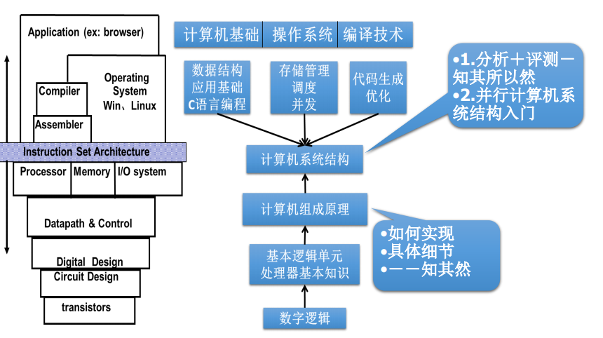
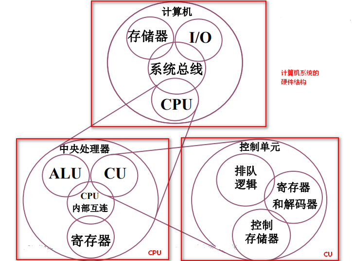

# 计算机组成原理

内容：

- 基本部件的结构和组织方式
- 基本运算的操作原理
- 基本部件和单元的设计思想

 

教材：

- 唐朔飞. **计算机组成原理**（第2版）.高等教育出版社
- David A.Patterson. John L.Hennessy. **Computer Organization & Design: A Hardware/Software Interface**(计算机组成与设计：硬件/软件接口)
- David Harris, Sarah Harris. **Digital Design and Computer Architecture**. Morgan Kaufmann, 2007(数字设计和计算机系结构)

结构：

- 计算机组成原理之机器
  - 计算机系统的基本概念
  - 总线
  - 存储器
  - 输入输出系统
- 计算机组成原理之数字
  - 计算机中数的表示
  - 计算机的运算方法和运算器
- 计算机组成原理之CPU
  - 指令系统
  - CPU的结构和功能
  - 控制单元
  - 控制单元的设计

## 概述

现代计算机系统由硬件 （计算机的实体 ）、软件（由具有各类特殊功能 的信息（程序）组成 ）两部分构成 

软件

- 系统软件：用来管理整个计算机系统 

  语言处理程序、操作系统、服务性程序、数据库管理系统、网络软件 

- 应用软件：按任务需要编制成的各种程序 

计算机系统的层次结构 

系统复杂性管理的方法 

- 抽象 
- 层次化（Hierachy）：将被设计的系统划分为多个模块或子模块
- 模块化（Modularity）：有明确定义 （well-defined）的功能和接口
- 规则性（regularity）：模块更容易被重用 

|                      |            |                        |
| -------------------- | ---------- | ---------------------- |
| Application Software | 应用软件   | programs               |
| Operating Systems    | 操作系统   | device drivers         |
| Architecture         |            | instructions registers |
| Micro-architecture   | 微体系     | datapaths controllers  |
| Logic                | 逻辑层     | adders memories        |
| Digital Circuits     | 数字电路层 | and gate not gate      |
| Analog Circuits      | 模拟电路层 | amplifiers filters     |
| Devices              | 电子元件层 | transistors diodes     |
| Physics              | 物理层     | electros               |

- 计算机体系结构 ：程序员所见到的计算机系统的属性概念性的结构与功能特性 （指令系统、数据类型、寻址技术、I/O机理） 
- 计算机组成：实现计算机体系结构所体现的属性 （具体指令的实现） 

### 计算机的基本组成 

冯·诺依曼计算机的特点 

1. 计算机由五大部件组成 
2. 指令和数据以同等地位存于存储器， 可按地址寻访 
3. 指令和数据用二进制表示 
4. 指令由操作码和地址码组成
5. 存储程序 
6. 以运算器为中心 

运算器：算术运算、逻辑运算 

控制器：指挥程序运行 

存储器：存放数据和程序

运算器是瓶颈

改进：以存储器为中心的结构

现代计算机结构

